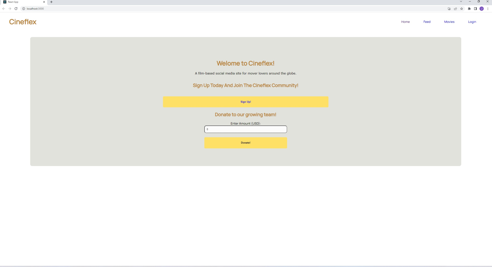
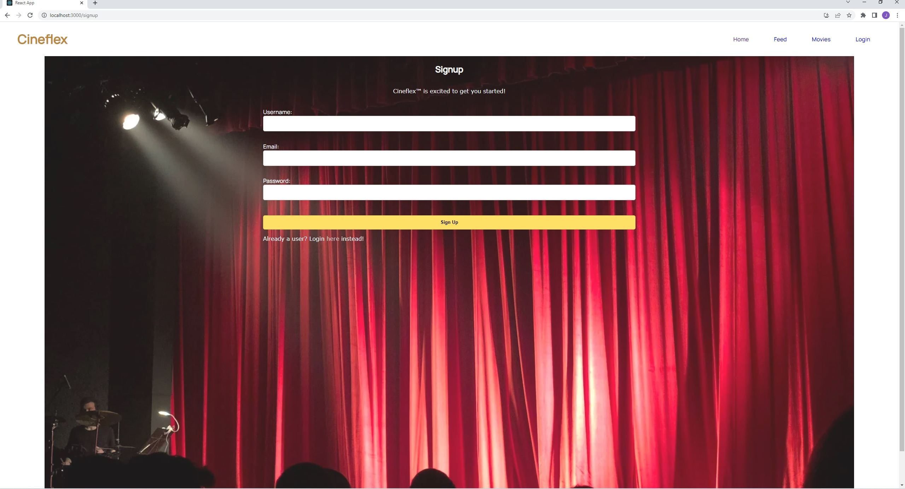

# CineFlex

## Project 3 Interactive MERN SPA Project

## Project Description

This Project allows users to search for movies by title. Once on the user has selected a movie they are able to leave reviews and review scores as well as read through other users reviews of the same movie

## Installation

You can clone the project from GitHub by copying either HTTPS or SSH link or by downloading the project as a zip file.

## Usage
After downloading all of the files, use command prompt, git bash or whatever your favorite terminal is. CD over to the root of the client folder, run NPM Start to connect to port 3000 then load up localhost:3000 to start your CineFlex experience. Alternatively you can run the program by visitng the deployed website here: https://frozen-oasis-34307.herokuapp.com/

## Deployed Website
https://frozen-oasis-34307.herokuapp.com/
## Screenshot
![Screenshot]

## Contribution

Made by:  
Charanvir Singh  
Fares Akhtar  
Joe Chaaya  
Joey Cosentino  
Rajendra Patel  
Taimur Hasan  

